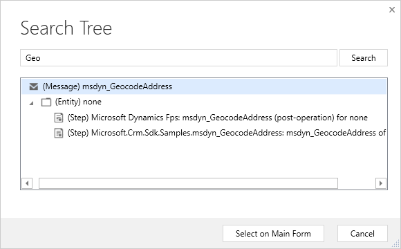

# Custom Geo Provider

[Custom plug-in to use Google Maps API and others as geospatial data provider](https://docs.microsoft.com/en-us/dynamics365/customer-engagement/common-scheduler/developer/sample-custom-plugin-google-geospatial-data-provider)

Each Provider contains a Singleton and a data contract to consume the response.

Not in Trimble Current dataset
1300 N Market Street, Opelousas, LA, 70570, NA

# Creates

# Reference
[CRM REST Builder](https://github.com/jlattimer/CRMRESTBuilder)

[Google Maps Geocoding API Console](https://console.cloud.google.com/google/maps-apis/apis/geocoding-backend.googleapis.com/metrics)

[Trimble Map Visualization](https://maps.alk.com/Developer/1.2/Default)

[Trimble Web REST Services](https://maps.alk.com/PCMDoc/RestServices)

[Trimble Trip Management](https://tripmanagement.alk.com/help/)
