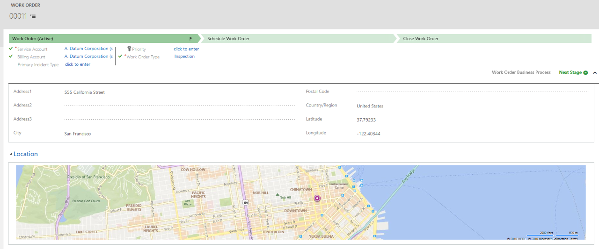
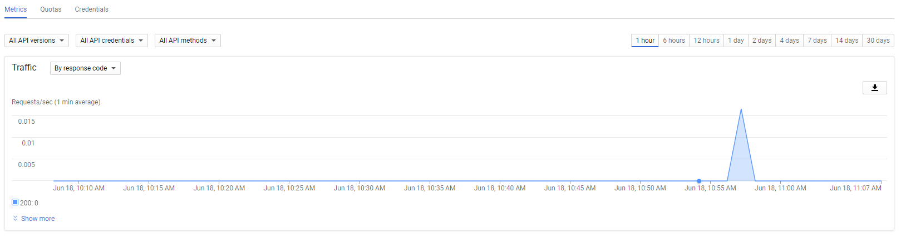
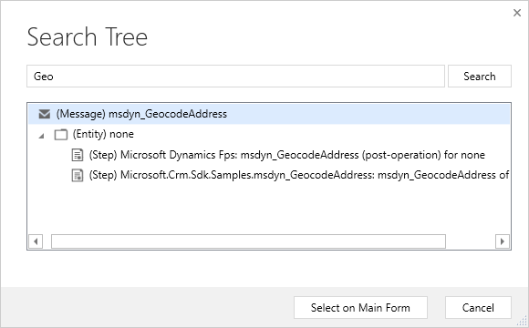

# Custom Common Data Service Geo Provider

A [custom CDS plug-in to use Google Maps API and others as geospatial data provider](https://docs.microsoft.com/en-us/dynamics365/customer-engagement/common-scheduler/developer/sample-custom-plugin-google-geospatial-data-provider).

Each Provider contains a singleton and a data contract to consume the response.

|   |
| :- |

| <h1 align="center">CDS Plug-in</h1>

 | <h1 align="center">Maps APIs</h1>

 |
| :------------------------ | :--------------------- |
| Server side C# event handler to run custom code in Dynamics 365 / Power Apps / CDS / Common Data Service / Maybe another rebrand one day :P. | Using Google maps and even Trimble or others (**Please contribute others if you'd like too**) can be supported to override the default Bing maps geospatial provider. |

# Creates

# Reference
Implemented
* [CRM REST Builder](https://github.com/jlattimer/CRMRESTBuilder)
* [Google Maps Geocoding API Console](https://console.cloud.google.com/google/maps-apis/apis/geocoding-backend.googleapis.com/metrics)

Not implemented
* [Trimble Map Visualization](https://maps.alk.com/Developer/1.2/Default)
* [Trimble Web REST Services](https://maps.alk.com/PCMDoc/RestServices)
* [Trimble Trip Management](https://tripmanagement.alk.com/help/)
